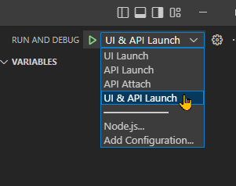

# Introduction
  
UI Dashboard to list the E-Commerce products  

## Getting Started

### Setup  to run app in VS Code in debug mode

1. Install latest Node.js, .Net 6+ SDK, AngularCli
2. Install [C# Extension](https://marketplace.visualstudio.com/items?itemName=ms-dotnettools.csharp) in VS Code
3. Run `npm run setup` command in the repository/project root
4. Now start debugging by selecting "UI & API Launch" debug config

	
5. Wait for Chrome window to launch for UI at location https://localhost:4200
6. Chrome will show error "Your connection is not private". To bypass this error:

		1. Click on "Advance" and then
		2. Then click "Proceed to localhost (unsafe)"
7. Login with following credentials:

		UserID: admin
		Password: admin
	